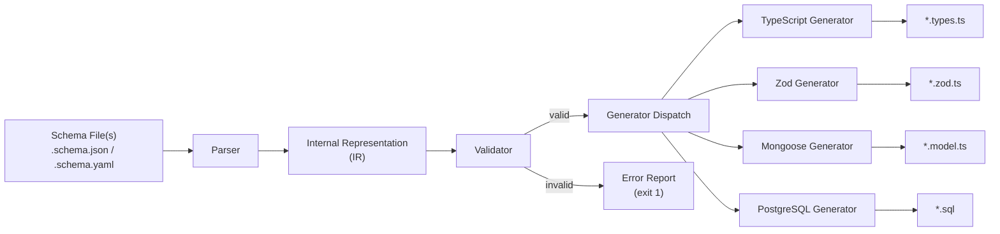

<div align="center">

# schema-cast

**A schema-first code generator for TypeScript, Zod, Mongoose, and PostgreSQL.**

[](https://www.npmjs.com/package/schema-cast)
[](https://opensource.org/licenses/MIT)
[](https://www.typescriptlang.org/)
[](https://github.com/Omnikon-Org/schema-cast/pulls)

Built by [Omnikon](https://github.com/Omnikon-Org)

[Philosophy](#philosophy) · [Architecture](#architecture-overview) · [CLI](#cli-reference) · [Comparison](#how-schema-cast-relates-to-other-tools) · [Roadmap](#project-roadmap)

</div>

---

## Value Proposition

`schema-cast` compiles a single data model definition into four artifacts that a typical fullstack TypeScript application needs, and would otherwise write and maintain by hand:

| Artifact | Consumer | Concern |
|---|---|---|
| TypeScript interface | Application code | Compile-time shape |
| Zod schema | API boundary | Runtime validation |
| Mongoose model | MongoDB driver | Document persistence |
| PostgreSQL DDL | Relational database | Table definition |

Each of these artifacts encodes the same information — field names, types, optionality, constraints — using a different representation for a different consumer. `schema-cast` does not introduce a new idea; it removes the manual translation step between representations that already exist in every non-trivial TypeScript backend.

It is a **build-time code generator**, not a runtime library, an ORM, or a schema standard. Generated files are checked into version control like any other generated code (comparable to `.proto`-generated stubs or Prisma Client output) and are inspectable, diffable, and debuggable without `schema-cast` installed.

---

## Philosophy

**A data model has one authoritative definition per bounded concept, and many consumers.**

This is intentionally not phrased as "one schema for your whole application." Real applications have many entities — `User`, `Post`, `Order`, `Invoice` — each with its own schema file. What `schema-cast` eliminates is not the plurality of schemas, but the plurality of *representations* of the same schema. A `User` entity should be defined once and compiled into every representation your stack needs, rather than hand-written four times in four different type systems that can silently drift apart.

Three design decisions follow from this:

1. **The source of truth is declarative, not code.** A schema is data (JSON/YAML), not a TypeScript class or decorator-annotated file. This keeps it generator-agnostic — new output targets can be added without changing how schemas are authored — and keeps it readable by non-TypeScript stakeholders (DBAs, API consumers, technical writers).
2. **Generation is one-directional.** Schema → code, never code → schema. There is no "introspect my database and infer a schema" step, by design. Round-tripping an inferred schema back into a hand-authored one is a well-known source of generator ambiguity (see [Prisma's introspection caveats](https://www.prisma.io/docs/orm/prisma-schema/introspection) for a concrete example of the class of problems this creates). `schema-cast` schemas are always human-authored and machine-compiled, not the reverse.
3. **Generated code has no runtime dependency on schema-cast.** The Zod schema, the Mongoose model, and the SQL file are plain, idiomatic output in their respective ecosystems. `schema-cast` disappears after `generate` runs — it is not a peer dependency of your application at runtime.

---

## What Schema Cast Is

- A **CLI code generator** that reads a declarative schema file and emits TypeScript, Zod, Mongoose, and SQL.
- A **build-time tool**, run manually, on file save (`watch` mode), or in CI, similar in role to `protoc`, `openapi-generator`, or `graphql-codegen`.
- An **opinionated field-type DSL** designed specifically for the four output targets above — every field type in the schema format exists because it maps cleanly to a construct in TypeScript, Zod, Mongoose, *and* SQL simultaneously.

## What Schema Cast Is Not

Being explicit here matters more than it might seem, because several adjacent tools are easy to confuse with `schema-cast` at a glance:

- **It is not JSON Schema.** `schema-cast` schema files are JSON or YAML *documents*, but they are not written in, validated against, or compatible with the [JSON Schema specification](https://json-schema.org/). There is currently no import or export path between the two formats. See [Schema Format vs. JSON Schema](#schema-format-vs-json-schema) below for the full rationale.
- **It is not an ORM.** `schema-cast` does not manage connections, run queries, perform migrations, or provide a query builder. It generates a Mongoose model file and a `CREATE TABLE` statement; what you do with them (Prisma, raw `pg`, Mongoose itself) is unrelated to `schema-cast`.
- **It is not a validation library.** Zod is the validation library. `schema-cast` generates Zod schema *code* — it does not validate anything at your application's runtime.
- **It is not a database migration tool.** The generated `.sql` file is a `CREATE TABLE` statement for a fresh schema, not a migration. Diffing schema versions into ALTER statements is a planned, unimplemented feature — see [Versioning Strategy](#versioning-strategy-planned).

---

## The Problem

In a typical fullstack TypeScript project, the same entity shape tends to be written independently in up to four places:

```
Frontend Type Definitions → TypeScript interface
Request/Response Validation → Zod schema
Application-Level Persistence → Mongoose model
Relational Storage → PostgreSQL DDL
```

These are written by different people, at different times, and updated on different schedules. A new required field added to the Zod validator does not necessarily reach the SQL table. A renamed TypeScript property does not necessarily reach the Mongoose model. Nothing enforces consistency across the four representations because nothing owns all four at once.

This is not a novel observation — it's the same motivation behind Protocol Buffers generating code for multiple languages from one `.proto` file, or OpenAPI generating clients and servers from one spec. `schema-cast` applies the same pattern narrowly: one declarative entity definition, compiled into the four representations a Node.js/TypeScript backend commonly needs.

## Why Schema-First Development Matters

"Schema-first" means the data shape is defined before, and independently of, the code that consumes it — as opposed to "code-first," where the shape is inferred from decorated classes or runtime object inspection.

The practical argument for schema-first in this context:

- **The schema is the thing under version control that actually changes.** Diffing a schema file in a pull request tells a reviewer exactly what changed about the data model, without reading four generated files.
- **It decouples authoring from target.** Adding a fifth generator (say, GraphQL SDL) later doesn't require touching every existing schema — only writing a new generator that reads the same intermediate representation.
- **It's inspectable by non-engineers.** A JSON/YAML field list is readable by a product manager or API consumer without TypeScript knowledge, unlike a decorated class.

The tradeoff, stated plainly: schema-first requires learning a schema format instead of writing familiar language-native code, and it adds a build step. `schema-cast` is a reasonable choice when four representations need to stay synchronized; it is unnecessary overhead for a project that only needs one.

---

## Architecture Overview

`schema-cast` is a **parse → validate → compile → emit** pipeline. There is no runtime component.



The **Internal Representation (IR)** is the architectural core: it is a normalized, generator-agnostic tree describing entities, fields, types, and constraints. Every generator consumes the same IR and has no knowledge of the original file format (JSON vs. YAML) or of each other. This is what makes adding a new output target additive rather than invasive — see [How Schema Cast Works Internally](#how-schema-cast-works-internally).

### Design boundary: the IR, not the file format, is the contract

A common misconception is that `schema-cast`'s value is "supports JSON and YAML." It isn't — file format is a convenience layer. The actual architectural contract that generators are written against is the IR. This distinction matters for anyone writing a custom generator (see [Planned Generators](#planned-generators)): target the IR, not the raw schema file.

---

## How Schema Cast Works Internally

1. **Discovery** — the CLI resolves `--input` to one or more `.schema.json` / `.schema.yaml` files, either a single file or every schema file under a directory (`--all`).
2. **Parsing** — each file is parsed into a raw AST. JSON and YAML converge to the same in-memory shape at this stage; nothing downstream is aware of which format was used.
3. **IR Construction** — the raw AST is normalized into the IR: field types are resolved to a closed set of primitive and composite kinds (see [Supported Field Types](#supported-field-types)), defaults are resolved, and nested `object`/`array` fields are flattened into an addressable tree.
4. **Validation** — the IR is checked for structural integrity: duplicate field names, an enum field missing `values`, an object field missing `fields`, a `primary` flag on more than one field, and similar class of errors. This is what `schema-cast validate` runs (see [Validation](#validation) for why this is scoped the way it is).
5. **Generator Dispatch** — for each requested output format, the corresponding generator walks the IR and emits a string of source code specific to its target language/format.
6. **Emit** — output files are written to `--out`, one file per entity per generator, using the naming convention `<entity>.<generator-suffix>`.

`watch` mode re-runs steps 2–6 for a single changed file rather than the full input set, using file modification timestamps to scope regeneration.

---

## Schema Organization

A `schema-cast` project is a **directory of schema files, one entity per file**, not a single monolithic schema:

```
schemas/
├── user.schema.json
├── post.schema.json
├── comment.schema.json
└── organization.schema.yaml
```

Each file declares exactly one top-level entity via its `name` field. This mirrors how the generated output is organized — one `.types.ts`, one `.zod.ts`, one `.model.ts`, and one `.sql` file per entity — and keeps diffs scoped to the entity that actually changed.

```bash
schema-cast generate --all --input ./schemas/ --out ./generated
```

### Cross-entity references

**Current state:** entities are independent. A field on `Post` referencing an author is expressed today as an inline `uuid` field (`authorId`) or a fully nested `object`, as shown in the [Complex Example](#complex-example) below — there is no schema-to-schema reference syntax yet.

**Planned:** a `$ref`-style reference so that `Post.author` can point at the `User` entity defined in `user.schema.json`, with the IR resolving the reference at build time rather than requiring the field to be duplicated inline. See [Relationship Support](#relationship-support-planned).

This is a deliberate, currently-unaddressed gap, not an oversight — it's called out explicitly rather than implied to work via nesting.

---

## Supported Generators

| Generator | Target | Status | Output |
|---|---|---|---|
| TypeScript | Static typing | Stable | `interface` declaration |
| Zod | Runtime validation | Stable | `z.object()` schema + inferred type |
| Mongoose | MongoDB | Stable | `Schema` + `model()` |
| PostgreSQL | Relational DDL | Stable | `CREATE TABLE` statement |

All four generators consume the same IR (see [Architecture Overview](#architecture-overview)) and can be run selectively via `--format`.

## Planned Generators

| Generator | Target | Status | Notes |
|---|---|---|---|
| Prisma schema | ORM schema definition | Planned | Emits `schema.prisma` model blocks, not a competing ORM |
| GraphQL SDL | API schema | Planned | Emits `type` definitions from the IR |
| gRPC / Protocol Buffers | RPC contracts | Planned | Emits `.proto` message definitions |
| OpenAPI | REST API schema | Planned (Phase 4) | Emits component schemas |

Nothing in this table is implemented. It's listed here so the IR's intended scope — any output that can be derived from a field-level entity definition — is clear even where the generator doesn't exist yet.

---

## Validation

`schema-cast validate` checks that a **`schema-cast` schema definition** is internally consistent. It does not validate JSON Schema documents, and it does not validate application data (JSON payloads) against a schema at runtime — that is what the *generated Zod schema* is for, once you import it into your own code.

```bash
schema-cast validate --input ./schemas/user.schema.json
```

What it currently catches:

- Missing `required` metadata leading to ambiguous optionality
- `type: "enum"` without a `values` array
- `type: "object"` without a nested `fields` array
- `type: "array"` without an `items` definition
- More than one field marked `primary`
- Duplicate field names within an entity

What it explicitly does **not** do:

- Validate a JSON document against JSON Schema (`schema-cast` schemas are not JSON Schema — see below)
- Validate runtime application data against generated types (use the generated Zod schema for that)
- Cross-entity reference checking (no reference syntax exists yet — see [Schema Organization](#schema-organization))

### Schema Format vs. JSON Schema

This is worth stating directly for readers coming from the JSON Schema ecosystem: **`schema-cast`'s schema format is a JSON/YAML *document*, but it is a purpose-built DSL, not an implementation of or extension to the [JSON Schema specification](https://json-schema.org/).**

Why a custom format instead of JSON Schema, given that JSON Schema already models types, required fields, and enums:

- JSON Schema is designed to describe and validate *data shape*, with no concept of storage-layer metadata — `primary`, `unique`, `index`, and per-database type mapping have no JSON Schema equivalent and would require non-standard vendor extensions (`x-*` keywords) to express.
- `schema-cast`'s IR needs a closed, small set of field types that map deterministically to all four generator targets simultaneously (see [Supported Field Types](#supported-field-types)); JSON Schema's `type` + `format` + `pattern` combinators are more expressive than any single generator target needs and would require a lossy subset mapping regardless.
- There is currently no tooling to import an existing JSON Schema document as a `schema-cast` schema, and no export path to emit one. This is a known gap: teams with an existing JSON Schema-described API do not get a free migration path today.

If your primary need is JSON Schema-compliant validation or interoperability with the broader JSON Schema tooling ecosystem (Ajv, `json-schema-to-typescript`, OpenAPI's `$ref` resolution), `schema-cast` is not currently a substitute for that tooling.

---

## Relationship Support (Planned)

**Not implemented today.** Entities are currently flat and independent; there is no foreign-key, reference, or `$ref` concept in the schema format.

The planned design, for context on direction:

```yaml
# post.schema.json (illustrative — not yet valid syntax)
name: Post
fields:
  - name: author
    type: reference
    ref: User          # resolved against user.schema.json at build time
    cardinality: one
  - name: comments
    type: reference
    ref: Comment
    cardinality: many
```

Compiling this would need to resolve differently per generator — a foreign key column in PostgreSQL, an `ObjectId` ref in Mongoose, a nested/joined type in TypeScript and Zod — which is precisely why it's staged as a distinct roadmap item rather than bolted onto the existing `object`/`array` field types. Today, model relationships by nesting an inline `object` (denormalized) or a bare `uuid`/`ObjectId` field (normalized, manually joined) as shown in [Complex Example](#complex-example).

---

## Versioning Strategy (Planned)

**Not implemented today.** There is no schema version field, no migration diffing, and no compatibility checking between two versions of the same entity.

The gap this leaves: if `user.schema.json` changes a field from optional to required, `schema-cast generate` will happily regenerate all four outputs with no warning that this is a breaking change to, say, an already-deployed PostgreSQL table with existing null values in that column.

Planned direction (Phase 3, see [Roadmap](#project-roadmap)):

- A `version` field on each schema, incremented on breaking changes
- A `schema-cast diff` command comparing two versions of an entity and classifying changes as additive vs. breaking
- SQL migration (`ALTER TABLE`) generation for the diff, rather than only fresh `CREATE TABLE` statements

Until this exists, treat schema changes with the same caution you'd apply to a hand-written migration — `schema-cast` does not currently protect you from a breaking change reaching your database.

---

## Project Roadmap

### Phase 1 — Core (Released)
- [x] JSON/YAML schema parsing and IR construction
- [x] TypeScript, Zod, Mongoose, PostgreSQL generators
- [x] CLI with `generate`, `watch`, `validate`
- [x] Published to npm

### Phase 2 — Ecosystem Integration
- [ ] Prisma schema generator
- [ ] GraphQL SDL generator
- [ ] Relationship support (`reference` field type)
- [ ] Schema versioning (`version` field, no diffing yet)

### Phase 3 — Change Management
- [ ] `schema-cast diff` — classify changes as additive/breaking
- [ ] SQL migration generation (`ALTER TABLE`, not just `CREATE TABLE`)
- [ ] CI integration examples (fail build on undeclared breaking change)

### Phase 4 — Additional Targets
- [ ] gRPC / Protocol Buffers generator
- [ ] OpenAPI component schema generator
- [ ] Additional language targets (evaluation stage — no committed language yet)

Items outside Phase 1 do not exist in the current release. This roadmap reflects sequencing intent, not a delivery commitment.

---

## How Schema Cast Relates to Other Tools

Rather than a feature checkbox comparison, the table below describes what **layer of responsibility** each tool owns. Several of these tools are not substitutes for `schema-cast` — they solve adjacent, non-overlapping problems.

| Tool | What it owns | Relationship to schema-cast |
|---|---|---|
| **JSON Schema** | A vendor-neutral spec for describing and validating JSON document shape | Not used by `schema-cast` internally (see [Schema Format vs. JSON Schema](#schema-format-vs-json-schema)); a JSON Schema import/export path is an acknowledged gap, not a design decision to avoid interop |
| **Zod** | Runtime validation library | A `schema-cast` *output target* — `schema-cast` generates Zod code, it doesn't replace Zod |
| **Mongoose** | MongoDB ODM (connections, queries, middleware) | A `schema-cast` *output target* for the schema-definition portion only; `schema-cast` does not touch connections or queries |
| **Prisma** | ORM: schema DSL + query engine + migrations + client generation | Not a competitor — a *planned generator target* (Phase 2). `schema-cast` may eventually emit a `schema.prisma` file; it has no query engine and never will |
| **OpenAPI Generator** | Generates clients/servers from an OpenAPI spec | Same category of tool (spec → code generator) but a different source format (OpenAPI vs. `schema-cast`'s own DSL) and different output targets (HTTP clients/servers vs. type/validation/persistence layers) |
| **GraphQL Code Generator** | Generates typed code from a GraphQL SDL | Same category of tool, different source format (GraphQL SDL) and different output targets (resolvers, hooks) |
| **Protocol Buffers / `protoc`** | Generates multi-language code from `.proto` IDL | Closest architectural analogue to `schema-cast`'s parse→IR→generate pipeline, but for RPC/wire-format contracts rather than a TypeScript backend's persistence and validation layers |

The corrected framing from earlier drafts of this document: `schema-cast` and Prisma are not in the same category. Prisma is an ORM with a runtime query engine; `schema-cast` has no runtime component and does not execute queries. The only accurate relationship is that Prisma's schema format is a *potential future generator output*, not a competitor being benchmarked feature-for-feature.

---

## Examples

### Minimal entity

```json
{
  "name": "User",
  "fields": [
    { "name": "id", "type": "uuid", "required": true, "primary": true },
    { "name": "email", "type": "email", "required": true, "unique": true },
    { "name": "role", "type": "enum", "values": ["admin", "user", "guest"], "default": "user" },
    { "name": "createdAt", "type": "date", "required": true }
  ]
}
```

```bash
schema-cast generate --input ./schemas/user.schema.json --out ./generated
```

Produces `user.types.ts`, `user.zod.ts`, `user.model.ts`, and `user.sql` — see [Supported Field Types](#supported-field-types) for the full type-to-output mapping.

### Complex Example

An entity with nested objects and array fields (today's mechanism for modeling relationships, pending [Relationship Support](#relationship-support-planned)):

<details>
<summary><strong>Post schema with nested author and comments</strong></summary>

```json
{
  "name": "Post",
  "fields": [
    { "name": "id", "type": "uuid", "required": true, "primary": true },
    { "name": "title", "type": "string", "required": true },
    { "name": "content", "type": "string", "required": true },
    { "name": "status", "type": "enum", "values": ["draft", "published", "archived"], "default": "draft" },
    {
      "name": "author",
      "type": "object",
      "fields": [
        { "name": "id", "type": "uuid", "required": true },
        { "name": "name", "type": "string", "required": true },
        { "name": "email", "type": "email", "required": true }
      ]
    },
    {
      "name": "comments",
      "type": "array",
      "items": {
        "type": "object",
        "fields": [
          { "name": "id", "type": "uuid", "required": true },
          { "name": "text", "type": "string", "required": true },
          { "name": "authorId", "type": "uuid", "required": true },
          { "name": "createdAt", "type": "date", "required": true }
        ]
      }
    },
    { "name": "tags", "type": "array", "items": { "type": "string" } },
    { "name": "createdAt", "type": "date", "required": true },
    { "name": "updatedAt", "type": "date", "required": true }
  ]
}
```

The nested `author` object is denormalized into a `JSONB` column in PostgreSQL and an embedded subdocument in Mongoose. This is a deliberate tradeoff of the current field model, not a hidden limitation — normalized relationships (a separate `Author` table with a foreign key) require the planned `reference` field type.

</details>

### Generated output for the minimal entity

<details>
<summary><strong>user.types.ts</strong></summary>

```typescript
export interface User {
  id: string;
  email: string;
  role: 'admin' | 'user' | 'guest';
  createdAt: Date;
}
```

</details>

<details>
<summary><strong>user.zod.ts</strong></summary>

```typescript
import { z } from 'zod';

export const UserSchema = z.object({
  id: z.string().uuid(),
  email: z.string().email(),
  role: z.enum(['admin', 'user', 'guest']).default('user'),
  createdAt: z.date(),
});

export type User = z.infer<typeof UserSchema>;
```

</details>

<details>
<summary><strong>user.model.ts</strong></summary>

```typescript
import { Schema, model } from 'mongoose';

const UserSchema = new Schema({
  email: { type: String, required: true, unique: true },
  role: { type: String, enum: ['admin', 'user', 'guest'], default: 'user' },
  createdAt: { type: Date, required: true },
});

export const UserModel = model('User', UserSchema);
```

</details>

<details>
<summary><strong>user.sql</strong></summary>

```sql
CREATE TABLE users (
  id         UUID PRIMARY KEY DEFAULT gen_random_uuid(),
  email      VARCHAR NOT NULL UNIQUE,
  role       VARCHAR CHECK (role IN ('admin', 'user', 'guest')) DEFAULT 'user',
  created_at TIMESTAMP NOT NULL
);
```

</details>

---

## CLI Reference

### `generate`

```bash
# Single file
schema-cast generate --input ./schemas/user.schema.json --out ./generated

# Entire directory
schema-cast generate --all --input ./schemas/ --out ./generated

# Restrict to specific generators
schema-cast generate --input ./schemas/ --out ./generated --format typescript,zod
```

| Flag | Description |
|---|---|
| `--input` | Path to a `.schema.json` / `.schema.yaml` file, or a directory when combined with `--all` |
| `--out` | Output directory for generated files |
| `--all` | Process every schema file under `--input` |
| `--format` | Comma-separated subset of `typescript,zod,mongoose,postgres` (default: all) |
| `--watch` | Equivalent to running `watch` after the initial generation |

### `watch`

```bash
schema-cast watch --input ./schemas/
```

Regenerates only the entity whose file changed, using file modification time to scope work — not a full re-run of the input directory.

### `validate`

```bash
schema-cast validate --input ./schemas/user.schema.json
```

Checks `schema-cast` schema definitions for internal structural errors. See [Validation](#validation) for exactly what is and isn't covered — this does not validate against the JSON Schema specification.

---

## Supported Field Types

| Type | TypeScript | Zod | Mongoose | PostgreSQL |
|---|---|---|---|---|
| `string` | `string` | `z.string()` | `String` | `VARCHAR` |
| `number` | `number` | `z.number()` | `Number` | `NUMERIC` |
| `boolean` | `boolean` | `z.boolean()` | `Boolean` | `BOOLEAN` |
| `date` | `Date` | `z.date()` | `Date` | `TIMESTAMP` |
| `uuid` | `string` | `z.string().uuid()` | `String` | `UUID` |
| `email` | `string` | `z.string().email()` | `String` | `VARCHAR` |
| `url` | `string` | `z.string().url()` | `String` | `VARCHAR` |
| `enum` | `'a' \| 'b'` | `z.enum([...])` | `{ enum: [...] }` | `CHECK (col IN (...))` |
| `object` | `{ ... }` | `z.object({...})` | Nested subdocument | `JSONB` |
| `array` | `T[]` | `z.array(...)` | `[{ type: T }]` | `JSONB` |
| `json` | `any` | `z.any()` | `Schema.Types.Mixed` | `JSONB` |

This is a closed set by design (see [Design boundary](#design-boundary-the-ir-not-the-file-format-is-the-contract)) — every type here was included because it has a deterministic mapping across all four targets. `reference` (see [Relationship Support](#relationship-support-planned)) will be the next addition.

### Field Options

| Option | Type | Description |
|---|---|---|
| `required` | `boolean` | Field must be present (default: `false`) |
| `unique` | `boolean` | Unique constraint (Mongoose + PostgreSQL) |
| `primary` | `boolean` | Primary key — `_id` in Mongoose, `PRIMARY KEY` in SQL. At most one per entity |
| `default` | `any` | Default value applied consistently across all four outputs |
| `index` | `boolean` | Database index hint |
| `values` | `string[]` | Required when `type` is `"enum"` |
| `fields` | `FieldDefinition[]` | Required when `type` is `"object"` |
| `items` | `FieldDefinition` | Required when `type` is `"array"` |
| `min` / `max` | `number` | Length or numeric range constraint |

---

## FAQ

**Is this the same as JSON Schema?**
No. See [Schema Format vs. JSON Schema](#schema-format-vs-json-schema) — different format, different goals, no interop yet.

**Can I import an existing JSON Schema document?**
Not currently. This is a known gap, not a planned non-goal — see the roadmap discussion in that section.

**Does `schema-cast validate` validate my API request payloads?**
No. It validates the *schema definition file itself* for structural correctness. To validate runtime data, import the generated Zod schema into your application code and call `.parse()`/`.safeParse()` as you would with any Zod schema.

**Is `schema-cast` a Prisma alternative?**
No. Prisma is an ORM with a query engine and migration system; `schema-cast` has neither. A Prisma schema generator is a planned *output target*, meaning `schema-cast` may eventually help you get to a `schema.prisma` file faster, not replace Prisma at runtime.

**How are relationships between entities modeled today?**
By nesting an `object` (denormalized) or referencing another entity's ID as a `uuid` field (normalized, joined manually in application code). First-class references are planned — see [Relationship Support](#relationship-support-planned).

**What happens if I change a field from optional to required?**
All four outputs regenerate to reflect the change with no warning about backward compatibility. There is no diffing or migration safety net yet — see [Versioning Strategy](#versioning-strategy-planned).

**Does `schema-cast` run at application runtime?**
No. It is a build-time CLI. The generated Zod/Mongoose/TypeScript code has no dependency on `schema-cast` itself once generated.

---

## Installation

```bash
npm install -g schema-cast
# or
npx schema-cast generate --input ./schemas/user.schema.json --out ./generated
```

## Project Structure

```
schema-cast/
├── src/
│   ├── index.ts              # Public API entry point
│   ├── parser.ts             # JSON / YAML → raw AST
│   ├── ir.ts                 # Raw AST → Internal Representation
│   ├── validators.ts         # IR structural validation
│   ├── generators/
│   │   ├── typescript.ts
│   │   ├── zod.ts
│   │   ├── mongoose.ts
│   │   └── postgres.ts
│   ├── cli.ts                # CLI entry point (commander.js)
│   └── watcher.ts             # Watch mode (chokidar)
├── tests/
└── README.md
```

---

## Contributing

```bash
git clone https://github.com/Omnikon-Org/schema-cast.git
cd schema-cast
npm install
npm run dev
npm test
```

Before submitting a PR that adds a new generator, read [Architecture Overview](#architecture-overview) and [How Schema Cast Works Internally](#how-schema-cast-works-internally) — new generators are written against the IR, not the raw schema file. Please open an issue before starting on a large PR (in particular, [Relationship Support](#relationship-support-planned) and [Versioning Strategy](#versioning-strategy-planned) affect the IR shape and should be discussed before implementation begins). See [CONTRIBUTING.md](./CONTRIBUTING.md) for full guidelines.

---

## Vision

`schema-cast`'s scope is deliberately narrow: one declarative entity format, compiled into the representations a TypeScript backend needs at the type, validation, and persistence layers. It is not trying to become an ORM, a validation runtime, or a JSON Schema implementation — each of those already has a good answer, and `schema-cast` generates code that plugs into them rather than replacing them.

The direction from here is to extend what the IR can express — relationships and versioning being the two structural gaps — before extending how many targets it compiles to. A generator for a fifth target is only as good as the IR underneath it; adding `reference` and `version` correctly matters more, in the near term, than adding GraphQL or Prisma output.

---

## Ecosystem

Other projects in the [Omnikon](https://github.com/Omnikon-Org) organization:

- **[PackVault](https://github.com/Omnikon-Org/PackVault)** — Offline-first npm package caching CLI
- **[IssueSwipe](https://github.com/Omnikon-Org/IssueSwipe)** — Swipe-based GitHub issue discovery for open-source contributors
- **[Abyss](https://github.com/Omnikon-Org/Abyss)** — Mobile IDE for Android development

[GitHub Organization](https://github.com/Omnikon-Org)

---

## License

MIT © [Omnikon](https://github.com/Omnikon-Org)
